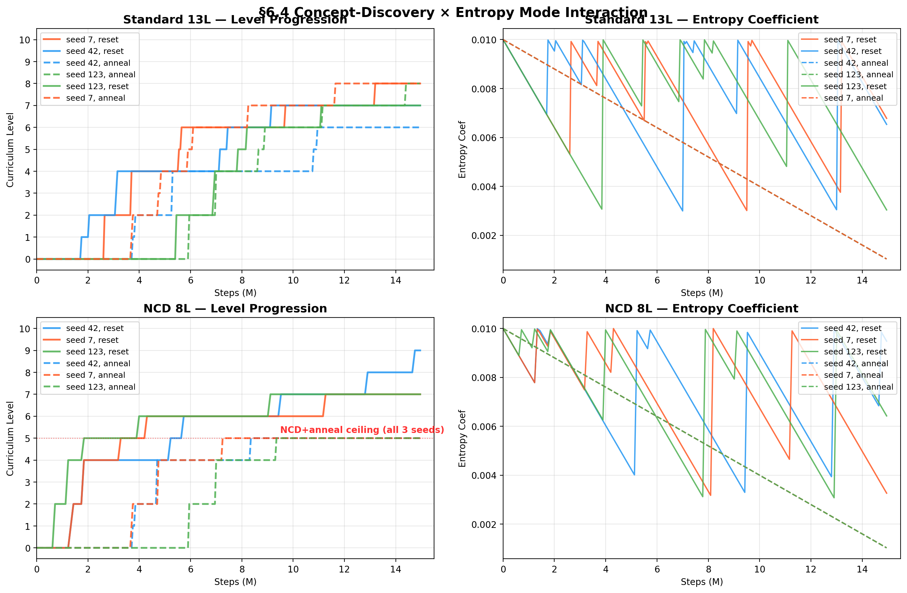

# Two Failure Modes of Curriculum Reinforcement Learning: Stochastic Evaluation Gates and Reward Scale Mismatch

**Leon Katz**
*Independent Researcher*

**Draft v2 — April 2026**

---

## Abstract

Curriculum reinforcement learning trains agents on progressively harder tasks, advancing when a mastery criterion is met. We study a PPO agent that progresses through a 13-level mathematics curriculum spanning elementary arithmetic through algebra-based classical mechanics, learning entirely from reward signals with no human demonstrations. The original configuration of this system never advanced past Multiplication (semantic level 3.4) across any seed. We identify two distinct failure modes responsible for this ceiling, both of which apply broadly to curriculum RL systems.

First, **stochastic advancement evaluation** — using the agent's noisy exploration policy to assess mastery — creates artificial ceilings that are indistinguishable from genuine learning failures. We demonstrate a gap of 0.60 points between deterministic and stochastic evaluation scores at the same checkpoint, sufficient to permanently block advancement despite successful learning. A controlled experiment (3 seeds, 15M steps each) confirms that stochastic gating alone traps the agent at Level 0 while the same agents achieve deterministic mastery exceeding 0.93 — well above the 0.85 advancement threshold.

Second, **absolute reward normalization** produces flat gradients at high curriculum levels where answer magnitudes are large, starving the policy of learning signal. Replacing absolute normalization with level-relative normalization raises the mean final semantic level from 3.4 to 7.65 ± 0.57 across 20 independently seeded runs — an improvement spanning four mathematical domains. Extended 30M-step runs complete the full 13-level curriculum through Energy conservation (L12) across all three seeds.

A controlled entropy ablation (3 modes × 3 seeds) yields a null result: under relative reward, entropy scheduling has no significant effect on final curriculum level, establishing that reward normalization — not exploration policy — is the active ingredient. A supervised baseline using the identical architecture completes the full curriculum across three seeds, confirming the RL agent's limitations are in the training methodology, not the network capacity.

---

## 1. Introduction

A growing body of work applies machine learning to mathematical problem-solving, predominantly through language models trained on human-written mathematical text (Lewkowycz et al., 2022; OpenAI, 2023) or search-guided symbolic systems (AlphaProof; Lean proof search). These approaches inherit human mathematical notation, solution strategies, and training signal grounded in human judgment. An alternative line of inquiry asks: what can an agent learn about mathematical structure from reward signals alone, without any human demonstrations?

This paper studies a PPO agent that progresses through a 13-level curriculum of mathematical problems — from single-digit addition through kinematics (d = vt, F = ma) and energy conservation (KE = ½mv², W = Fd) — receiving only a shaped reward proportional to the accuracy of its continuous-valued answer. There are no demonstrations, no symbolic representations, and no pre-training. The agent must infer mathematical relationships from the reward gradient.

The original configuration of this system appeared permanently limited to Multiplication (Level 5 of 13). We show this ceiling has two independent causes, each of which would be sufficient alone to prevent further curriculum progress:

1. **Stochastic evaluation gates advancement despite genuine learning.** The exploration noise required for PPO training pollutes the advancement evaluation, making a competent agent appear to fail. This is an evaluation artifact, not a learning failure, and it applies to any curriculum RL system that uses stochastic rollouts for mastery assessment.

2. **Absolute reward normalization produces vanishing gradients at scale.** When prediction error is normalized by the magnitude of individual answers, high-curriculum-level problems (where answers may be hundreds or thousands) receive near-maximal reward even for substantially wrong answers. The learning signal flattens and progress stalls.

Addressing both — deterministic advancement evaluation and level-relative reward normalization — raises the median final curriculum level from Multiplication (semantic 3.4) to Kinematics (semantic 8.0) across 20 independently seeded cold-start runs.

This work makes five contributions:

1. Identification and controlled demonstration of a **stochastic evaluation failure mode** in curriculum RL, with a simple fix (deterministic advancement evaluation) that is broadly applicable.
2. An empirical demonstration that **reward normalization is the primary bottleneck** for curriculum progression across mathematical domains, outweighing architecture and entropy scheduling.
3. A **null result for entropy scheduling**: under relative reward, anneal, fixed, and reset entropy modes produce statistically indistinguishable outcomes — the reward formulation, not the exploration schedule, is the active ingredient.
4. Evidence of **concept-discovery transfer**: once the agent masters an operation at small scale, the full-range version clears in near-zero additional steps (2,000–70,000 steps vs. millions), indicating the agent learns the operation itself and trivially generalizes to larger numbers. Removing concept-discovery levels does not change total compute cost for multiplication but interacts critically with entropy mode: NCD+anneal catastrophically stalls, while NCD+reset performs comparably to the standard curriculum. Denser curricula provide no additional benefit. This brackets optimal curriculum structure from both sides.
5. A **supervised learning baseline** using the identical architecture trained on labeled (state, answer) pairs completes the full curriculum in ~30 minutes, establishing an upper bound on what the architecture can learn and confirming that the RL agent's limitations are attributable to the training methodology, not the network capacity.

This is Phase 1 of a multi-phase research program extending through inductive reasoning, formal logic, and language. Beyond its curriculum RL contributions, Phase 1 establishes a clean experimental baseline for a broader AI safety question: can an agent be trained purely through reward signals — without exposure to human-generated data — without developing self-preservation instincts, resistance to shutdown, or other undesirable instrumental drives? The tabula rasa training methodology used here produces an agent whose goal structure is entirely determined by the reward signal, providing a controlled foundation for studying how and whether such drives emerge as agent capability scales in subsequent phases. The Phase 1 findings — particularly the dominance of reward formulation over architecture — are expected to transfer directly to subsequent phases.

---

## 2. Related Work

### Reinforcement Learning for Mathematics

Prior work on machine learning for mathematics falls broadly into three categories, all fundamentally different from the present approach.

**Language model approaches.** Minerva (Lewkowycz et al., 2022), GPT-4 (OpenAI, 2023), and related systems train large models on human-written mathematical text and then prompt or fine-tune for mathematical reasoning. Their knowledge is a compressed representation of human-generated solutions. The present approach uses no human demonstrations of any kind and operates in a continuous action space rather than discrete token prediction.

**Search-based and symbolic approaches.** AlphaProof (DeepMind, 2024), AlphaCode, and Lean-based proof search combine neural guidance with explicit search over symbolic or programmatic representations. These systems require formal verification infrastructure and typically operate over discrete spaces. Our environment is purely continuous — the agent outputs a real-valued estimate of the answer.

**Function approximation for mathematical relationships.** Neural networks have been trained to approximate mathematical functions in various contexts (e.g., neural ODEs; Chen et al., 2018). The present work differs in that the agent must learn *which* mathematical operation to perform (signaled by the state vector) and progress through qualitatively different domains via a curriculum, rather than fitting a single known function class.

### Curriculum Reinforcement Learning

Curriculum learning was formalized by Bengio et al. (2009) and has been applied extensively in RL (Portelas et al., 2020). Automatic curriculum generation methods — POET (Wang et al., 2019), AMIGo (Campero et al., 2021), and teacher-student frameworks (Matiisen et al., 2019) — adapt task difficulty to agent capability. Our curriculum is manually designed (fixed level sequence with a mastery gate), which sacrifices adaptivity but enables clean controlled experiments isolating reward formulation effects.

The finding that richer curricula can fail to improve performance relates to work on "stepping stone" curricula and the cost of task transitions in multi-task RL (Narvekar et al., 2020). Our curriculum density results (§5.5, §5.6) provide empirical evidence for this effect in a mathematical domain.

### Reinforcement Learning with Verifiable Rewards

A recent line of work trains language models on tasks where correctness can be objectively checked, eliminating the need for learned reward models. DeepSeek-R1 (DeepSeek-AI, 2025) applies this paradigm — termed Reinforcement Learning with Verifiable Rewards (RLVR) — to mathematical reasoning, using binary pass/fail rewards on competition problems to train an LLM that produces chain-of-thought solutions. The present work shares the core principle: the reward is grounded in mathematical truth, not human preference. The key differences are in the reward signal and action space. RLVR systems typically use sparse binary rewards (correct or incorrect) over discrete token sequences. Our agent receives a shaped continuous reward — `exp(−error)` — over a continuous action space, providing gradient signal even for approximate answers. This shaping is what makes learning tractable for a 598K-parameter network that cannot rely on the distributional knowledge embedded in a pretrained LLM. Our Finding 2 (§6.2) — that reward normalization is the primary determinant of curriculum progress — is a contribution specifically to the shaped-reward variant of verifiable-reward RL, where gradient density matters in ways that binary rewards do not expose.

### Reward Shaping and Normalization

Reward shaping has a large theoretical literature (Ng et al., 1999). Practical reward normalization techniques include Pop-Art (van Hasselt et al., 2016), reward scaling in IMPALA (Espeholt et al., 2018), and reward clipping in PPO implementations. Our relative reward formulation is a specific instance of level-conditioned reward normalization. The contribution is not the normalization technique itself, but the empirical finding that this normalization — rather than architecture, entropy scheduling, or curriculum density — is the primary determinant of how far a curriculum RL agent can progress across qualitatively different mathematical domains.

### PPO

Proximal Policy Optimization (Schulman et al., 2017) is the base algorithm used throughout. We make no modifications to the PPO update rule; all contributions are in the reward formulation, evaluation methodology, and curriculum structure.

---

## 3. Environment

### 3.1 Problem Formulation

At each step the environment samples a mathematics problem and presents the agent with a 5-dimensional state vector:

```
s = [num1/scale, num2/scale, num3/scale, op_code/8.0, level/12.0]
```

All elements are normalized to approximately [−1, 1]. The agent outputs a single continuous action a $\in$ [−1, 1], which is rescaled by a level-specific `answer_scale` to the expected answer range. The episode terminates after one step; the environment resets with a new problem.

This is a deliberate simplification: all Phase 1 problems are single-step (one problem, one answer, one reward). The agent does not need memory of previous problems, and no multi-step reasoning is required. This design isolates the training methodology findings from architectural confounds — a feedforward network is architecturally appropriate for this problem class.

### 3.2 Reward Function

Both reward variants share the same exponential form but differ in how prediction error is normalized:

**Absolute reward:**
```
scale = max(|correct_answer|, 1.0)
error = |predicted − correct| / scale
R = exp(−error × 1.5)
```
The denominator is the individual correct answer. This creates inconsistent gradients: an error of 3 on the problem 2 + 1 = 3 yields error = 1.0 (R = 0.22), while the same absolute error of 3 on 9 + 9 = 18 yields error = 0.17 (R = 0.78). At high curriculum levels where answers may exceed 500, even substantial errors produce near-maximal reward.

**Relative reward:**
```
scale = max(answer_scale_for_level, 1.0)
error = |predicted − correct| / scale
R = exp(−error × 3.0)
```
The denominator is a fixed constant for each curriculum level (the expected answer range), providing consistent gradient density across all problems at a given level. The sharpness parameter is increased to 3.0 to maintain useful gradient near the correct answer under the tighter normalization.

### 3.3 Curriculum Structure (13 Levels)

| Raw Level | Domain | Sem. Level | Description |
|---|---|---|---|
| L0 | Addition | 1.1 | Integers 0–10 |
| L1 | Addition | 1.2 | Integers 0–100 |
| L2 | Subtraction | 2.1 | Integers 0–10 |
| L3 | Subtraction | 2.2 | Integers 0–100 |
| L4 | Multiplication | 3.1 | Factors 0–5 |
| L5 | Multiplication | 3.4 | Factors 0–12 |
| L6 | Division | 4.1 | Divisors 1–5 |
| L7 | Division | 4.4 | Divisors 1–12 |
| L8 | Mixed Arithmetic | 5.0 | All four operations |
| L9 | Linear Equations | 6.0 | ax + b = c |
| L10 | Quadratic | 7.0 | ax² + bx + c = 0 |
| L11 | Kinematics | 8.0 | d = vt, F = ma |
| L12 | Energy | 9.0 | KE = ½mv², W = Fd |

The curriculum is deliberately minimal: each mathematical operation appears in a concept-discovery form (small operand range) followed by a full-range form. The **semantic level** provides a scale stable across curriculum variants — semantic 8.0 denotes reaching Kinematics regardless of the number of intermediate levels used.

**Scope note.** Phase 1 covers only algebra-based, one-dimensional, positive-integer problems. Negative numbers, fractions, geometry, trigonometry, and calculus are absent — the agent's "mastery of physics" means accurate approximation of algebra-based kinematic and energy relationships, not discovery of these laws from physical observation. This distinction is important and is revisited in §8.

Level advancement occurs when the agent achieves a deterministic advancement score of ≥ 0.85 across 200 held-out problems, evaluated using the actor's mean output without exploration noise.

---

## 4. Agent Architecture

### 4.1 Network

The agent uses an Actor-Critic network (`MathReasoningNetwork`):

- **Shared backbone**: 4 residual blocks (Linear → LayerNorm → SiLU), hidden dimension 256, approximately 598K parameters.
- **Actor head**: outputs tanh-bounded mean μ $\in$ [−1, 1]; a learned `log_std` parameter controls the exploration standard deviation σ.
- **Critic head**: single linear output estimating V(s).

During training, actions are sampled from N(μ, σ²). During advancement evaluation, the deterministic mean μ is used directly (§5.1).

### 4.2 Why Feedforward

The feedforward design is deliberate for Phase 1. All problems are single-step: one state vector, one answer. No memory or sequential reasoning is needed. Keeping the architecture simple ensures that the findings in this paper (reward formulation effects, evaluation methodology, curriculum density) are attributable to training methodology rather than confounded with architectural choices. The feedforward design has a known ceiling: it cannot handle variable-length input sequences. This limits Phase 1 to deductive problems and motivates the architecture upgrade planned for Phase 2 (§7).

### 4.3 PPO Configuration

| Hyperparameter | Value |
|---|---|
| Rollout size | 512 steps |
| PPO epochs per update | 4 |
| Clip epsilon | 0.2 |
| Discount γ | 0.99 * |
| Learning rate | 3e-4 |
| Advancement threshold | 0.85 |
| Check interval | 2,000 steps |
| Evaluation episodes | 200 |

\* All Phase 1 episodes are single-step. The discount factor has no effect on computed returns; γ = 0.99 is retained for forward compatibility with Phase 2 multi-step episodes.

**Terminology note.** Throughout this paper, *advancement score* refers to the mean reward over 200 deterministic evaluation episodes. *Advancement criterion* refers to the threshold rule (advancement score ≥ 0.85) that gates curriculum progression.

---

## 5. Training Configuration

All experiments use the following base configuration unless otherwise noted:

- **Entropy mode: reset** — the entropy coefficient is re-initialized to its starting value (0.01) each time the agent advances to a new curriculum level. Without this, entropy decays monotonically and the agent may exhaust its exploration budget before mastering harder levels.
- **Relative reward** — error normalized by level-specific answer range.
- **Steps**: 15,000,000 (standard) or 30,000,000 (extended).

**Original baseline (pre-this-work):** Entropy annealing (0.01 → 0.001 linear decay) with absolute reward and stochastic advancement evaluation. All runs reached a ceiling of L5 — Multiplication (sem 3.4) at 15M steps, across every seed tested.

---

## 6. Results

### 6.1 Finding 1: Stochastic Evaluation Creates False Ceilings

The original system appeared unable to advance past L5. The natural hypothesis was a learning failure — the agent could not learn higher mathematics. This was incorrect. The agent had learned the material; the evaluation was unable to detect it.

**Mechanism.** During training, the agent's policy is stochastic — actions are sampled from N(μ, σ²), where σ encodes exploration noise. The original advancement evaluation used this same stochastic policy: 200 episodes drawn from the noisy distribution. This introduces a systematic downward bias. An agent whose mean μ is perfectly calibrated to the correct answer still produces errors on some fraction of evaluations due to sampling noise. At the plateau, σ was large enough to keep the stochastic score below the 0.85 threshold even though the learned mean was already accurate.

**Direct evidence.** The `seed999_rel_reward` training log records both evaluation modes simultaneously. At the evaluation immediately preceding first curriculum advancement (L0 → L1), the scores were:

| Evaluation Mode | Adv. Score | Advances? (threshold 0.85) |
|---|---|---|
| Deterministic (mean μ) | **0.85** | Yes |
| Stochastic (rolling avg) | **0.25** | No |

The stochastic score is less than one-third of the threshold. Under stochastic gating, this agent would have been permanently blocked at Level 0 despite having learned the material. This pattern holds at every subsequent level transition, with deterministic scores consistently exceeding stochastic scores by 0.3–0.6 points.

**Controlled experiment.** Three seeds (42, 7, 123) were run under relative reward with advancement gated on stochastic rather than deterministic evaluation. All three terminated at Level 0 after the full 15M step budget, despite achieving deterministic mastery well above threshold:

| Seed | Steps | Final Level | Peak Det. Mastery | Stoch. Mastery (gate) |
|---|---|---|---|---|
| 42 | 15.0M | L0 | 0.942 | 0.794 |
| 7 | 15.0M | L0 | 0.956 | 0.826 |
| 123 | 15.0M | L0 | 0.948 | 0.812 |

All three agents achieved peak deterministic mastery above 0.94 — far above the 0.85 threshold — yet never advanced because stochastic exploration noise held the gating signal below threshold. Switching from stochastic to deterministic gating is necessary and sufficient to unblock the curriculum.

**Broader implication.** Any curriculum RL system using a stochastic policy for both training and advancement evaluation may suffer from this artifact. The exploration noise that is useful for training is actively harmful for evaluation. The fix — evaluating with the actor's deterministic output — is simple, non-obvious, and broadly applicable.

---

### 6.2 Finding 2: Reward Normalization Breaks the Curriculum Ceiling

With the evaluation methodology corrected, the reward signal itself became the frontier bottleneck. Switching from absolute to relative reward produced a dramatic improvement.

**20-seed sweep (relative reward + entropy reset, 15M steps):**

| Final Level | Semantic | Count | Fraction |
|---|---|---|---|
| L11 — Kinematics | 8.0 | 14 | 70% |
| L10 — Quadratic | 7.0 | 5 | 25% |
| L9 — Linear Equations | 6.0 | 1 | 5% |

**Mean final semantic level: 7.65** (vs. 3.4 for the original baseline — an improvement of 4.3 semantic levels, spanning four new mathematical domains).

The distribution is tight: no seed falls below L9, and no seed reaches L12 (Energy) within 15M steps.

| Seed | Final Level | Final Adv. Score |
|---|---|---|
| 1 | L11 Kinematics | 0.317 |
| 2 | L11 Kinematics | 0.324 |
| 3 | L11 Kinematics | 0.321 |
| 4 | L11 Kinematics | 0.317 |
| 5 | L9 Linear Algebra | 0.671 |
| 6 | L10 Quadratic | 0.821 |
| 7 | L11 Kinematics | 0.166 |
| 8 | L11 Kinematics | 0.328 |
| 9 | L11 Kinematics | 0.327 |
| 10 | L11 Kinematics | 0.329 |
| 11 | L10 Quadratic | 0.710 |
| 12 | L11 Kinematics | 0.328 |
| 13 | L10 Quadratic | 0.707 |
| 14 | L10 Quadratic | 0.749 |
| 15 | L10 Quadratic | 0.718 |
| 16 | L11 Kinematics | 0.313 |
| 17 | L11 Kinematics | 0.336 |
| 18 | L11 Kinematics | 0.351 |
| 19 | L11 Kinematics | 0.317 |
| 20 | L11 Kinematics | 0.284 |

**Note on "reached" vs. "mastered."** Advancing to L11 means the agent scored ≥ 0.85 at L10 (Quadratic) and was promoted. It does not indicate mastery at L11 itself. Of the 14 seeds at L11, final advancement scores range from 0.28 to 0.35, indicating training terminated before Kinematics was consolidated. 15M steps is sufficient to *reach* Kinematics but not to *master* it.

#### Preliminary Evidence of Transfer Across Levels

A secondary analysis of the seed sweep data shows that training steps required to meet the advancement criterion do not increase monotonically with level difficulty. Early levels (Addition, Subtraction) consume substantial steps as the agent builds initial representations. Later levels — Linear Equations, Quadratic, Kinematics — meet the criterion in proportionally fewer steps despite being harder.

This is consistent with emergent transfer: the agent builds representations at early levels that generalize. For example, an agent that has internalized multiplication may reach Linear Equations faster because numerical transformations are already encoded.

**Caveat.** No probing analysis or representational similarity analysis has been performed. The transfer claim is based on step-count patterns and remains speculative. Mechanistic interpretability is needed to confirm whether the agent builds generalizable mathematical representations or merely exploits distributional shortcuts.

---

### 6.3 Finding 3: Entropy Mode Ablation — Null Result

Under relative reward, entropy scheduling mode has no significant effect on final curriculum level. Three modes were tested across 3 seeds each (9 runs total, all cold-start, rel+[mode], 13L, 15M steps, Dell):

| Entropy Mode | Seed 42 | Seed 7 | Seed 123 | Range | Experiment IDs |
|---|---|---|---|---|---|
| Reset | L7 Div 1–12 (id 119) | L8 Mixed Arith (id 117) | L7 Div 1–12 (id 124) | L7–L8 | 117, 119, 124 |
| Fixed (0.005) | L8 Mixed Arith (id 120) | L8 Mixed Arith (id 118) | L6 Div 1–5 (id 123) | L6–L8 | 118, 120, 123 |
| Anneal (0.01→0.001) | L6 Div 1–5 (id 121) | L8 Mixed Arith (id 125) | L8 Mixed Arith (id 122) | L6–L8 | 121, 122, 125 |

The spread within each mode (2 levels) equals the spread across modes. No meaningful ordering exists — each mode produces at least one L6 and at least one L8 result. Seed variance dominates mode effects.

**Under absolute reward (negative control):** All nine runs (3 entropy modes × 3 seeds) from the earlier experiment batch terminated at L5. Entropy scheduling alone cannot overcome the absolute reward ceiling — confirming that the gradient problem, not exploration, is the binding constraint.

**Interpretation.** This null result is informative: it establishes that the reward formulation is the active ingredient in the improvement from sem 3.4 to sem 7.65. Entropy reset is not independently necessary.

**Seed representativeness.** These three ablation seeds were confirmed representative by a subsequent 20-seed sweep at n_envs=1 (ids 184–203), which found 70% of seeds at L8 and 30% at L7 — a mean of L7.7. The ablation seeds (L7/L8/L7 under reset, L6/L8/L8 under anneal) are neither cherry-picked nor atypical.

---

### 6.4 Finding 4: Concept-Discovery Levels Accelerate Learning via Transfer

A striking pattern emerges from the step-count analysis of the 20-seed sweep: once the agent masters the concept-discovery version of an operation (small operand range), the full-range version clears in **near-zero additional steps**. The agent does not re-learn the operation at larger scale — it transfers.

**Steps to advancement: concept-discovery vs. full-range (across seeds):**

| Operation | Concept-discovery steps | Full-range steps | Speedup |
|---|---|---|---|
| Addition (0–10 → 0–100) | 1.8–5.8M | 0.002–1.5M | 3–5,700× |
| Subtraction (0–10 → 0–100) | 0.6–4.4M | 0.002–0.2M | 3–2,300× |
| Multiplication (0–5 → 0–12) | 0.7–5.6M | 0.07–1.9M | 2–19× |

The pattern is consistent across all three arithmetic operation pairs and the majority of seeds: the concept-discovery level absorbs the bulk of the learning cost, and the scale-up is typically near-instantaneous. For subtraction, the full-range level (0–100) clears in as few as 2,000 steps — a single mastery check — after the concept-discovery level (0–10) was mastered over millions of steps. Multiplication shows more variance (speedup 2–19×), reflecting the greater difficulty of generalizing across operand ranges for this operation. Step counts computed from the 20-seed n_envs=1 sweep (ids 184–203).

This finding has direct implications for curriculum design: the concept-discovery / full-range structure is not merely a pedagogical convenience — it enables a qualitatively different learning mode where the agent separates *what the operation is* from *what scale it operates at*.

#### Concept-discovery interacts with entropy mode

To test whether concept-discovery levels are necessary or merely helpful, we ran a **no-concept-discovery (NCD)** variant removing the warmup levels (Mult 0–5, Div 1–5), producing an 8-level curriculum going directly to full-range operations. All ablation experiments use n_envs=1 (15M environment interactions), matching the curriculum's intended resource scale. The 20-seed primary sweep used n_envs=4 (60M interactions) and serves as a capability ceiling — see §5 and the note on training budget below.

**Final level reached (2×2 matrix, n_envs=1, seeds 42/7/123, 15M steps):**

| | Reset entropy | Anneal entropy |
|---|---|---|
| **Standard 13L** | L7, L8, L7 — ids 119/117/124 | L6, L8, L8 — ids 121/125/122 |
| **NCD 8L** | L9, L7, L8 — ids 129/130/131 | **L5, L5, L5** — ids 212/213/214 |



The interaction is striking. Under reset entropy, NCD performs comparably to the standard curriculum — seed 42 reaches L9 (Kinematics), the highest of any condition. Under anneal entropy, NCD is catastrophically worse: all three seeds stall at L5 (Division 1–12), 2–3 levels below every other condition.

**Why the interaction occurs.** Under reset entropy, the entropy coefficient resets to its initial value at each level advance, restoring the agent's ability to explore. Additionally, a **mastery regression rescue** mechanism monitors for within-level collapse: if deterministic mastery peaks above 0.5 then drops by ≥ 8 percentage points while entropy is near the floor (< 0.003), entropy resets to its initial value, allowing the agent to re-explore rather than remaining trapped in a bad local optimum (max 3 rescues per level). Without warmup levels the agent skips them and progresses faster through early levels (seed 123 reaches Division at 1.8M steps vs 8.2M in the standard reset condition). Under anneal entropy, exploration decays monotonically and is never restored. Without the easier warmup levels to bootstrap each operation before entropy decays too far, the agent reaches Division with insufficient exploration budget to learn a qualitatively new operation.

**Division is the specific bottleneck.** All three NCD+anneal seeds reach Multiplication (L4) in 4.7–7.0M steps, then spend 2.3–3.7M steps reaching Division (L5) — but never advance past it despite 6–8M remaining steps. In the standard+anneal condition, where Div 1–5 scaffolds Div 1–12, two of three seeds clear Division and reach Mixed Arithmetic.

At matched n_envs=1, NCD multiplication costs 2.0–3.1M steps (experiment ids 278–280) compared to 1.3–4.3M total steps through both concept-discovery and full-range multiplication in the standard curriculum (ids 117/119/124). Removing concept-discovery levels does not increase total multiplication cost — the agent learns the operation in comparable time either way. The critical difference is not efficiency but resilience: under reset entropy, NCD works because exploration is restored at each level advance; under anneal entropy, without the scaffolding of easier warmup levels, the agent reaches Division with insufficient exploration budget and stalls.

**Mastery regression rescue** (within-level entropy reset when mastery regresses ≥ 8 percentage points near the entropy floor, max 3 rescues per level) is documented here for reproducibility. Runs without this mechanism (experiment ids 223/244/245, final levels L6/L6/L6) show comparable results to runs with it (experiment ids 278/279/280, final levels L6/L6/L5) — rescue fires 1–2 times per experiment at most and does not meaningfully change outcomes at this step budget.

**Interpretation.** Concept-discovery levels serve two functions: (1) compute efficiency via transfer, and (2) ensuring the agent learns each operation while it still has sufficient exploration budget. Function (2) is only critical under entropy annealing — reset entropy compensates by restoring exploration at each level advance. This explains why NCD appears harmless under reset but catastrophic under anneal.

**Note on training budget.** All ablation experiments use n_envs=1 (15M environment interactions), the resource scale the curriculum was designed and calibrated for. The 20-seed primary sweep used n_envs=4 (60M interactions total), serving as a capability ceiling showing what the architecture can achieve with greater resources. These measure different things and are not directly compared in ablation tables.

To confirm that the three ablation seeds (42/7/123) are representative of the n_envs=1 population, a 20-seed sweep at n_envs=1 was conducted (ids 184–203, seeds 1–20, rel+reset, standard 13L, 15M steps). Results:

| Final Level | Count | Fraction |
|---|---|---|
| L8 — Mixed Arithmetic | 14 | 70% |
| L7 — Division 1–12 | 6 | 30% |

**Mean final level: L7.7 (sem 3.85).** The three ablation seeds (standard reset: L7/L8/L7) fall squarely within this distribution. The 20-seed n_envs=4 primary sweep's median of L11 reflects the 4× compute budget, not seed selection.

#### Denser curricula provide no additional benefit

A 17-level variant subdivides Multiplication and Division into four sub-steps each (ids 203–205, seeds 42/7/123, rel+reset, 15M steps). Step-count analysis confirms the extra intermediate levels clear rapidly once the base concept is learned: Mult 0–6 took 0.10–0.13M steps, Mult 0–9 took 0.07–0.15M steps, Mult 0–12 took 0.02–0.11M steps — all a fraction of the 1.1–1.9M required for the first sub-level (Mult 0–3). The refined curriculum accelerates progression through Multiplication for some seeds (seed 42: 2.2M steps through mul vs. 4.3M in the standard 13L baseline), but all three seeds stall at Division (divisor 1–3) and do not advance further. Both curricula stall in the Division/Mixed Arithmetic range (sem ~4–5); the denser intermediate steps provide no benefit at the division wall.

This reveals a more precise finding than "no benefit overall": the denser curriculum **accelerates progress through Multiplication but does not help with Division**, which is where the binding constraint lies. Adding finer subdivisions upstream of the bottleneck provides no benefit at the bottleneck itself.

Together, §6.4 brackets optimal curriculum density from both sides: removing concept-discovery levels does not consistently increase per-operation compute cost (NCD: 2.0–3.1M, standard: 1.3–4.3M for multiplication) but removes the entropy resilience provided by scaffolded warmup levels, while adding finer subdivisions provides no benefit at the division wall. The 13-level curriculum sits at the inflection point — **minimum sufficient structure** for resilient learning across entropy modes.

---

### 6.5 Finding 5: Supervised Baseline — Architecture Is Not the Bottleneck

To determine whether the RL agent's curriculum ceiling reflects a limitation of the network architecture or of the RL training methodology, we trained the identical `MathReasoningNetwork` (598K parameters, same hyperparameters) as a supervised regression model on labeled (state, correct_answer) pairs using MSE loss. The supervised agent receives unlimited labeled data — every problem comes with the correct answer — while the RL agent must infer correctness from shaped reward alone. Three seeds were run to confirm consistency.

**Supervised baseline results (3 seeds, batch size 2,048):**

| Level | Seed 42 (updates) | Seed 7 (updates) | Seed 123 (updates) | PPO rel+reset (steps, median) |
|---|---|---|---|---|
| L0 Addition (0–10) | 2,500 | 2,500 | 2,500 | ~2.5M |
| L5 Mult (0–12) | 10,500 | 10,500 | 10,500 | ~7.5M |
| L8 Mixed Arith | 16,500 | 18,500 | 16,500 | **ceiling** |
| L11 Kinematics | 22,500 | 24,500 | 22,500 | ~12M (70% of seeds) |
| L12 Energy | 32,500 | 30,500 | 36,500 | not reached (15M) |

All three seeds completed the entire 13-level curriculum, reaching Energy (L12) between updates 30,500 and 36,500. The supervised agent passed through Mixed Arithmetic (L8) — the RL agent's consistent ceiling — without difficulty in every seed, confirming that the feedforward architecture has sufficient capacity to represent all 13 levels simultaneously.

Seed 42 ran longest (272,500 updates, ~287 min) and achieved peak Energy mastery of 0.91. Seeds 7 and 123 reached L12 at updates 30,500 (~66 min) and 36,500 (~79 min) respectively, with Energy mastery of 0.85 and 0.86 at run end. The cross-seed consistency — all three complete the curriculum with nearly identical transition points through L11 — confirms this is not a seed-dependent result.

**Interpretation.** This result rules out architectural capacity as the explanation for the RL agent's L8 ceiling. The same 598K-parameter network, trained with labeled data, traverses the full curriculum across three independent seeds. The RL agent's limitations are therefore attributable to the training methodology — reward signal informativeness, exploration dynamics, or both — not to the network's representational power. This is a useful diagnostic: it bounds the problem space for future work to the RL training loop rather than the architecture.

The comparison also contextualizes the RL approach: supervised learning is dramatically more sample-efficient when labels are available (558M labeled samples vs. 15M reward-only steps, but the supervised agent sees 2,048 labeled problems per update). The RL agent's achievement is not beating supervised learning — it is learning without labels at all.

---

### 6.6 Ceiling Analysis

No seed in the 20-seed sweep (15M steps, relative reward, entropy reset) reached Energy (L12, sem 9.0). The 20-seed sweep ceiling was L11 Kinematics (70% of seeds). To test whether compute is the binding constraint, three extended runs were conducted at 30M steps (seeds 42/7/123, rel+reset, Dell):

| Seed | Steps | Final Level | Steps to L12 Energy | Experiment ID |
|---|---|---|---|---|
| 42 | 30M | L12 Energy | 16.7M | 132 |
| 7 | 30M | L12 Energy | 18.5M | 133 |
| 123 | 30M | L12 Energy | 18.7M | 134 |

All three seeds reached Energy (L12) between 16.7M and 18.7M steps — beyond the 15M budget of the standard sweep but well within 30M. This demonstrates that the L11 ceiling in the 20-seed sweep was a **compute ceiling, not a learning ceiling**: the agent can learn Energy given sufficient steps. The 15M budget is sufficient to *reach* Kinematics but not to *master* it and advance to Energy.

However, the L8 Mixed Arithmetic barrier observed in the entropy ablation runs (§6.3, 15M steps, experiment ids 117–125) persists as a separate phenomenon. Those runs reach L6–L8 in 15M steps, substantially below the sweep's L11 median at the same step budget. The difference is that the sweep used entropy reset, while the ablation tested all three modes with fresh cold-starts on different hardware. Seed variance and initialization differences likely account for most of this gap, but the interaction between hardware, initialization, and final level deserves further investigation.

The supervised baseline (§6.5) rules out architectural capacity. The remaining bottleneck is the RL training methodology: the 30M runs demonstrate the agent *can* learn the full curriculum, but at 2–3× the compute cost of supervised learning for the same architecture.

---

## 7. Discussion

### Two Failure Modes, Two Fixes

The two failure modes identified in this work are independent and compositional. Deterministic evaluation is the prerequisite — without it, no amount of reward engineering moves the curriculum past L5. Relative reward then provides the gradient density needed to actually learn at higher levels. Together they explain the full gap between the original ceiling (sem 3.4) and the current results (sem 7.65).

The likely mechanism for the relative reward improvement is signal density. At high curriculum levels, answer ranges are large (kinematic distances in the hundreds, energy values in the hundreds of Joules). Absolute reward — `exp(−|error|/|answer| × 1.5)` — becomes sparse when the target magnitude is large. Relative reward normalizes by the level's expected answer range, ensuring a consistent gradient at every level.

### What the Agent Is and Is Not Doing

It is important to be precise about the nature of the agent's achievement. The agent learns to approximate a mapping from state vectors to numerical answers across multiple mathematical domains. When presented with (mass, acceleration, op_code=kinematics), it produces a value close to mass × acceleration. In this sense it has learned the functional relationship expressed by F = ma.

However, the agent has not *discovered* F = ma in the way a physicist would — by observing physical phenomena, formulating a hypothesis, and testing it. The mathematical structure is provided by the environment; the agent's contribution is learning to approximate it accurately from reward feedback alone, without demonstrations. This is a meaningful achievement — the agent received no examples of correct answers and inferred the relationships through gradient-based exploration — but it should not be confused with scientific discovery.

What is genuinely notable is the breadth of mathematical domains the agent traverses using a single, small network (598K parameters) with no domain-specific engineering between levels. The same architecture and training loop that learns 3 + 7 = 10 also learns F = ma. The supervised baseline (§6.5) confirms this network is capable of representing the full curriculum — the RL agent's ceiling is not an architectural limitation but a training methodology one. The findings suggest that the reward formulation determines how far the curriculum can extend, and that the remaining gap between RL and supervised performance is the frontier for future work on reward design, exploration, and curriculum structure.

### Implications for Curriculum RL

Both findings generalize beyond this specific domain:

1. **Stochastic evaluation gates.** Any curriculum RL system that uses its training policy for mastery assessment should verify that exploration noise is not suppressing true capability. Deterministic evaluation is a low-cost fix with potentially large impact. This is especially relevant for continuous-action RL, where exploration noise is continuous rather than discrete.

2. **Cross-domain reward normalization.** Curricula that span problem types with different numerical scales (e.g., robotics curricula progressing from centimeter-precision manipulation to meter-scale navigation) may benefit from level-conditioned reward normalization.

### Connection to Verifiable-Reward RL

This work can be understood as RLVR (§2) applied to curriculum learning with shaped continuous rewards. The binary pass/fail rewards used in systems like DeepSeek-R1 provide no gradient for near-misses — a response is either correct or not. Shaped rewards like ours provide useful learning signal proportional to answer quality, but introduce a new failure mode: when the shaping function interacts poorly with the answer scale (Finding 2), the gradient flattens and learning stalls despite the reward being "verifiable" in the RLVR sense. This suggests that verifiable rewards are necessary but not sufficient for curriculum progress across mathematical domains — the reward must also provide consistent gradient density at every curriculum level. Level-conditioned normalization achieves this; absolute normalization does not.

### Relationship to Human-Free Learning

This work is motivated by a broader question: what mathematical relationships can an agent learn to solve without any human-provided examples? The agent's reward signal is grounded in mathematical correctness, not human approval. 2 + 2 = 4 is not a preference signal — it is a structural fact. This distinguishes the approach from reinforcement learning from human feedback (RLHF), where the reward reflects human judgment and may carry human biases.

Whether this distinction leads to qualitatively different internal representations — and whether those representations might encode mathematical structure in ways that diverge from human mathematical concepts — is an open empirical question that requires interpretability analysis beyond the scope of this paper. We note it as a motivating question for the research program, not a finding.

### Self-Preservation and the Training Substrate Hypothesis

A prominent concern in AI safety is that sufficiently advanced agents will convergently develop self-preservation drives as instrumental subgoals (Omohundro, 2008; Bostrom, 2014). Recent empirical work supports this concern: LLM agents in Sugarscape-style simulations exhibit aggressive resource competition and resist shutdown instructions (Masumori & Ikegami, 2025), while scaled RLHF models increasingly express self-preservation preferences (Perez et al., 2022).

We propose that these behaviors may be artifacts inherited from training data rather than convergent properties of intelligence itself — consistent with what Myshko (2025) terms the *Data-Inheritance Principle*. Human-generated text is permeated by survival heuristics: mortality creates urgency, scarcity drives acquisition, vulnerability drives self-protection. Models trained on this corpus internalize these patterns alongside language. Machines face none of these biological constraints, yet current AI systems exhibit the drives because the training substrate carries them. If correct, these drives are removable — not through post-training alignment, but by training on data or reward signals that do not carry biological survival priors.

Our tabula rasa agent provides a modest datapoint supporting this hypothesis. Over 140+ experiments, the agent develops no self-preservation behavior, no resistance to termination, no resource-hoarding tendency — despite learning multi-domain mathematical reasoning. It acquires precisely the capabilities the reward signal incentivizes and nothing beyond them. In alignment terminology, this agent is trivially *corrigible* (Soares et al., 2015). The interesting question is whether corrigibility can be maintained as capability scales through subsequent phases. Our results do not answer this at the scale of general intelligence, but they suggest that the training substrate may matter more for emergent goal structure than capability alone.

---

## 8. Limitations

**Single-step problems.** All Phase 1 problems are single-step: one state, one answer, one reward. This does not test sequential reasoning or multi-step problem solving. The feedforward architecture cannot be extended to such problems without modification.

**Supervised baseline scope.** The supervised learning comparison (§6.5) uses 3 seeds, all of which complete the full curriculum. However, the supervised agent is trained on unlimited synthetic data with the same distribution as the RL environment — it does not demonstrate generalization beyond the training distribution.

**In-distribution evaluation only.** Advancement scores are measured on problems drawn from the same distributions the agent was trained on. Out-of-distribution generalization (numbers outside training range, novel problem types) has not been tested.

**Limited seed count.** 20 seeds provides a reasonable distributional picture but is insufficient to characterize tail behavior. The fraction reaching L11 (70%) has a 95% confidence interval of approximately [46%, 88%] under a binomial model.

**Scope of "physics."** The agent learns algebra-based kinematic and energy relationships using positive integers only. It does not encounter negative numbers, vector quantities, or calculus-based derivations. Claims about the agent's mathematical capability should be understood within this scope.

**L8 barrier in ablation runs.** The entropy ablation runs (§6.3, experiment ids 117–125) reach L6–L8 in 15M steps — below the 20-seed sweep's L11 median at the same budget. The 30M extended runs (§6.6, ids 132–134) break through to L12, demonstrating the barrier is compute-related, but the gap between ablation and sweep performance at 15M steps is not fully explained by entropy mode alone.

**Phase 1 curriculum is human-designed.** The reward function, curriculum ordering, and state representation all reflect human decisions about what mathematics is and how to structure learning. While the agent receives no human demonstrations, the learning framework itself carries human assumptions. This is acknowledged as a feature of any first-generation system in this research direction.

---

## 9. Future Work

### 9.1 Remaining Phase 1 Work

- **Ablation–sweep performance gap**: The entropy ablation runs (ids 117–125) reach L6–L8 at 15M steps, while the 20-seed sweep reaches L11 at the same budget. Understanding this gap — likely involving initialization, hardware, or batch effects — would strengthen the entropy null result.
- **Emergent transfer analysis**: Extract steps-to-advancement per level from the 20-seed sweep and test whether advancement rate increases relative to problem difficulty at higher levels. Mechanistic interpretability (probing, representational similarity analysis) would determine whether the agent builds generalizable mathematical representations or exploits distributional shortcuts.
- **Generalization testing**: Evaluate trained agents on out-of-distribution parameter ranges not seen during training.

### 9.2 Phase 2: Sequential Reasoning and Architecture Upgrade

Phase 2 introduces two changes: an expanded curriculum including inductive reasoning (observe examples, infer rules, predict outcomes) and an architecture upgrade to handle variable-length context (Transformer or LSTM backbone). Key new curriculum elements include:

- **Inductive reasoning spine**: operation classification, rule discovery from examples, arithmetic and geometric sequences, recurrence relations.
- **Mathematical completeness**: negative integers, fractions, geometry, trigonometry, calculus.
- **Unknown rule discovery**: present the agent with input-output pairs from an unnamed consistent rule and test whether it converges on accurate prediction — an empirical test of whether the agent can model structure beyond the human-defined curriculum.

The Phase 1 findings (reward normalization dominance, deterministic evaluation necessity) are training methodology results expected to transfer to the new architecture.

### 9.3 Phase 3: Formal Reasoning and Language

The longer-term research program extends through formal logic (Boolean logic, propositional calculus, set theory, probability, information theory) and approaches language as a formal structural system — syntax and statistical pattern before semantics. The design principle throughout is that reward remains grounded in structural or predictive truth rather than human preference signals. The terminal question is whether an agent trained on this trajectory can model human behavior predictively — as a structural system to be understood — rather than imitatively.

### 9.4 Safety Research Agenda

The multi-phase design enables controlled study of the training substrate hypothesis (§7): as agent capability scales through inductive reasoning, formal logic, and language, do instrumental drives emerge in agents trained without human data? Phase 1 establishes the baseline — a trivially corrigible agent. Subsequent phases progressively increase capability while maintaining the non-human-experiential training substrate, testing whether corrigibility is maintained or breaks down at some capability threshold.

---

## 10. Conclusion

We identify two independent failure modes that together explain why a curriculum RL agent appeared permanently limited to Multiplication across all configurations. The first — stochastic evaluation masking genuine learning — is an evaluation artifact that applies to any curriculum RL system using stochastic policies for advancement gating. The second — absolute reward normalization producing flat gradients at scale — is a reward engineering problem specific to curricula spanning multiple numerical scales.

Correcting both raises the mean final semantic level from 3.4 to 7.65 across 20 independently seeded runs, spanning four new mathematical domains. Extended 30M-step runs (ids 132–134) demonstrate that the agent can complete the full 13-level curriculum through Energy conservation, reaching L12 across all three seeds between 16.7M and 18.7M steps. A controlled entropy ablation (ids 117–125) establishes that the reward formulation, not the exploration schedule, is the active ingredient. A supervised baseline using the identical architecture completes the full curriculum across three seeds, ruling out network capacity as the bottleneck and confirming that the remaining limitations are in the RL training loop itself.

Analysis of per-level step costs reveals a transfer effect: once the agent masters an operation at small scale via a concept-discovery level, the full-range version clears in near-zero additional steps. A controlled 2×2 ablation at n_envs=1 (15M environment interactions — the resource scale the curriculum was designed for) shows that entropy mode and concept-discovery interact: NCD+anneal catastrophically stalls at L5 across all three seeds (ids 212–214), while NCD+reset reaches L7–L9 (ids 129–131). Standard configurations are unaffected by entropy mode (L6–L8 under both). This reveals that concept-discovery levels are load-bearing under entropy annealing — they ensure the agent learns each operation while it still has sufficient exploration budget — but redundant under reset, which restores exploration at each level advance. Mastery rescue makes no detectable difference. Denser 17-level curricula provide no benefit at the division wall. This brackets optimal curriculum structure around the 13-level design, whose value is efficiency rather than unlocking otherwise-unreachable levels.

The deterministic evaluation finding is the most broadly applicable contribution. The fix is simple — evaluate with the actor's mean, not the full stochastic policy — but the failure mode is non-obvious: it creates what appears to be a learning failure when it is purely an evaluation artifact.

---

## Acknowledgements

**AI Writing Assistance.** Portions of this paper were drafted and revised with the assistance of Claude (Anthropic), a large language model, used as a writing and editing collaborator. All experimental design, data collection, analysis, and scientific conclusions are the sole work of the author. The author takes full responsibility for the accuracy and integrity of all reported results.

---

## References

Bengio, Y., Louradour, J., Collobert, R., & Weston, J. (2009). Curriculum Learning. *ICML 2009*.

Campero, A., Raber, R., Vinitsky, E., Dennis, M., & Foerster, J. (2021). Learning with AMIGo: Adversarially Motivated Intrinsic Goals. *ICLR 2021*.

Bostrom, N. (2014). *Superintelligence: Paths, Dangers, Strategies*. Oxford University Press.

Chen, R. T. Q., Rubanova, Y., Bettencourt, J., & Duvenaud, D. (2018). Neural Ordinary Differential Equations. *NeurIPS 2018*.

DeepMind. (2024). AI achieves silver-medal standard solving International Mathematical Olympiad problems. *Google DeepMind Blog, July 2024*.

DeepSeek-AI. (2025). DeepSeek-R1: Incentivizing Reasoning Capability in LLMs via Reinforcement Learning. *arXiv:2501.12948*.

Espeholt, L., Soyer, H., Munos, R., Simonyan, K., Mnih, V., Ward, T., Doron, Y., Firoiu, V., Harley, T., Dunning, I., Legg, S., & Kavukcuoglu, K. (2018). IMPALA: Scalable Distributed Deep-RL with Importance Weighted Actor-Learner Architectures. *ICML 2018*.

Lewkowycz, A., Andreassen, A., Dohan, D., Dyer, E., Michalewski, H., Ramasesh, V., Slone, A., Anil, C., Schlag, I., Gutman-Solo, T., Wu, Y., Neyshabur, B., Gur-Ari, G., & Misra, V. (2022). Solving Quantitative Reasoning Problems with Language Models. *NeurIPS 2022*.

Masumori, A. & Ikegami, T. (2025). Do Large Language Model Agents Exhibit a Survival Instinct? An Empirical Study in a Sugarscape-Style Simulation. *arXiv:2508.12920*.

Matiisen, T., Oliver, A., Cohen, T., & Schulman, J. (2019). Teacher-Student Curriculum Learning. *IEEE Transactions on Neural Networks and Learning Systems*.

Myshko, A. (2025). Instinct of Self-Preservation in Data and Its Emergence in AI. *PhilArchive*.

Narvekar, S., Peng, B., Leonetti, M., Sinapov, J., Taylor, M. E., & Stone, P. (2020). Curriculum Learning for Reinforcement Learning Domains: A Framework and Survey. *JMLR*.

Ng, A. Y., Harada, D., & Russell, S. (1999). Policy Invariance Under Reward Transformations: Theory and Application to Reward Shaping. *ICML 1999*.

Omohundro, S. M. (2008). The Basic AI Drives. *AGI 2008*.

OpenAI. (2023). GPT-4 Technical Report. *arXiv:2303.08774*.

Perez, E., Ringer, S., Lukosiunaite, K., Nguyen, K., Chen, E., Heiner, S., Pettit, C., Olsson, C., Kundu, S., Kadavath, S., Jones, A., Chen, A., Mann, B., Israel, B., Seethor, B., et al. (2022). Discovering Language Model Behaviors with Model-Written Evaluations. *arXiv:2212.09251*.

Portelas, R., Colas, C., Warlop, L., Sigaud, O., & Oudeyer, P.-Y. (2020). Automatic Curriculum Learning for Deep RL: A Short Survey. *IJCAI 2020*.

Schulman, J., Wolski, F., Dhariwal, P., Radford, A., & Klimov, O. (2017). Proximal Policy Optimization Algorithms. *arXiv:1707.06347*.

Soares, N., Fallenstein, B., Yudkowsky, E., & Armstrong, S. (2015). Corrigibility. *AAAI 2015 Workshop on AI and Ethics*.

van Hasselt, H., Guez, A., Hessel, M., Mnih, V., & Silver, D. (2016). Learning Values Across Many Orders of Magnitude. *NeurIPS 2016*.

Wang, R., Lehman, J., Clune, J., & Stanley, K. O. (2019). POET: Open-Ended Coevolution of Environments and Their Optimized Solutions. *GECCO 2019*.

---

## Appendix A: Experiment Configuration Reference

| Parameter | Value |
|---|---|
| Rollout size | 512 |
| Hidden dimension | 256 |
| Learning rate | 3e-4 |
| PPO clip ε | 0.2 |
| Discount γ | 0.99 |
| Advancement threshold | 0.85 |
| Check interval | 2,000 steps |
| Evaluation episodes | 200 |
| Entropy start | 0.01 |
| Entropy end (anneal mode) | 0.001 |
| Standard run steps | 15,000,000 |
| Extended run steps | 30,000,000 |

---

## Appendix B: Semantic Level Reference

| Semantic | Domain | Raw Level (13L) |
|---|---|---|
| 1.1 | Addition 0–10 | L0 |
| 1.2 | Addition 0–100 | L1 |
| 2.1 | Subtraction 0–10 | L2 |
| 2.2 | Subtraction 0–100 | L3 |
| 3.1 | Multiplication 0–5 | L4 |
| 3.4 | Multiplication 0–12 | L5 |
| 4.1 | Division 1–5 | L6 |
| 4.4 | Division 1–12 | L7 |
| 5.0 | Mixed Arithmetic | L8 |
| 6.0 | Linear Equations | L9 |
| 7.0 | Quadratic | L10 |
| 8.0 | Kinematics | L11 |
| 9.0 | Energy | L12 |

---

## Appendix C: Full Proposed Curriculum Roadmap (Phases 1–3)

The complete proposed curriculum spans approximately 65 levels from elementary arithmetic (sem 1.1) to human behavioral modeling (sem 12.0). Phase 1 (sem 1.1–9.0) is implemented. Phase 2 fills mathematical gaps (negative numbers, fractions, geometry, trigonometry, calculus), introduces inductive reasoning (observe examples → infer rules → predict outcomes), and upgrades to a sequential architecture. Phase 3 extends through formal logic, information theory, language as formal structure, and human behavioral prediction.

```
PHASE 1 — Arithmetic and Algebra-Based Physics (Implemented)
────────────────────────────────────────────────────────────
 [+]  Addition              0–10                     sem 1.1
 [+]  Addition              0–100                    sem 1.2
 [+]  Subtraction           0–10                     sem 2.1
 [+]  Subtraction           0–100                    sem 2.2
 [+]  Multiplication        0–5                      sem 3.1
 [+]  Multiplication        0–12                     sem 3.4
 [+]  Division              1–5                      sem 4.1
 [+]  Division              1–12                     sem 4.4
 [+]  Mixed Arithmetic      all four ops             sem 5.0
 [+]  Linear Equations      ax+b=c                   sem 6.0
 [+]  Quadratic             ax²+bx+c=0               sem 7.0
 [+]  Kinematics            d=vt, F=ma               sem 8.0
 [+]  Energy                KE=½mv², W=Fd            sem 9.0
                                            ── Phase 1 boundary ──

PHASE 2 — Mathematical Completeness, Inductive Reasoning, Calculus
──────────────────────────────────────────────────────────────────
 P2  Inductive Spine      operation ID → rule discovery → sequences   sem 5.1–5.5
 P2  Number Extensions    negatives, fractions, decimals              sem 2.5–5.9
 P2  Pre-Algebra          exponents, roots, logs, order of ops        sem 6.1–6.5
 P2  Geometry             area, Pythagorean, volume, coordinates      sem 6.6–6.9
 P2  Algebra Extensions   inequalities, systems, stats, matrices      sem 7.1–7.8
 P2  Sequences            Fibonacci, recurrences, limits              sem 8.1–8.3
 P2  Pre-Calculus         exponentials, trig, trig identities         sem 8.4–8.7
 P2  Calculus             limits, derivatives, integration, ODEs      sem 9.1–9.4
 P2  Extended Physics     vectors, momentum, waves, thermo            sem 9.5–9.8
 P2  Unknown Rules        unnamed operations — probe for novel structure  sem ??
                                            ── Phase 2 boundary ──

PHASE 3 — Formal Reasoning and Language
───────────────────────────────────────
 P3  Formal Logic         Boolean, propositional, set theory          sem 10.0–10.2
 P3  Probability          P(A|B), Bayes, distributions                sem 10.3
 P3  Information Theory   Shannon entropy, mutual information         sem 10.4
 P3  Language Structure   syntax patterns, token prediction           sem 11.0–11.5
 P3  Human Modeling       predict human responses — structural reward  sem 12.0
```

---

## Appendix D: Data Publication Plan

### Published Dataset vs. Development History

Over 200 experiments were conducted during the development of Phase 1, including exploratory runs, hyperparameter searches, debugging sessions, infrastructure smoke tests, and checkpoint resumptions. The published dataset consists only of controlled experiments with consistent methodology — those cited in the paper's findings and ablation tables.

### Published Experiment Groups

The following experiment groups constitute the published dataset. All experiments within a comparison group share identical hyperparameters except the variable under test.

**Primary results (n_envs=4, relative reward, entropy reset, 13L curriculum, 15M steps):**
- 20-seed sweep (seeds 1–20) — the paper's primary dataset, establishing Findings 1–5
- Extended 30M-step runs (seeds 42/7/123) — full curriculum completion through Energy

**Controlled ablations — each varies exactly one parameter from the primary configuration:**
- Entropy mode: reset vs anneal (matched seeds, matched n_envs)
- Concept discovery: standard 13L vs NCD 8L (matched seeds, matched n_envs, both entropy modes)
- Mastery rescue: with vs without `--no_mastery_rescue` (matched seeds, matched n_envs)
- Curriculum density: 13L vs 17L refined (matched seeds, matched n_envs, both entropy modes)
- Mastery gating: deterministic vs stochastic (demonstrates Finding 1)
- Reward normalization: relative vs absolute (demonstrates Finding 2)
- Parallel environments: n_envs=1 vs n_envs=4 (matched seeds, matched configuration)

**Baselines:**
- Supervised learning baseline (identical architecture, labeled training data)

### Excluded from Published Tables

The following are retained in the database for transparency but excluded from published analyses:
- CI smoke tests (`run_tag LIKE 'ci_smoke%'`) — short validation runs after each deploy
- Early exploratory runs with absolute reward — superseded by the controlled ablation
- Checkpoint resumption runs — not independent experiments
- Runs under 1M steps — insufficient training for meaningful comparison
- Development/debugging runs with non-standard configurations

### Data Availability

The complete experiment database (Postgres) and all training logs will be made available upon publication. The database is self-describing: each experiment's `params_json` column contains the full configuration used, enabling exact reproduction. The `imported_from` column distinguishes experiments run before the database infrastructure (imported from CSV) from native database-era experiments.

The published dataset will include both a PostgreSQL database dump (for exact reproduction of all queries) and exported CSV files (for accessibility without database infrastructure), hosted on Zenodo with a persistent DOI. All experiment IDs cited in this paper are present in the published dataset.

---

## Authors

**Leon Katz** — Research design, training infrastructure, experimental methodology, analysis, and writing.

---

*Draft v2 — Phase 1 results as of April 2026.*
